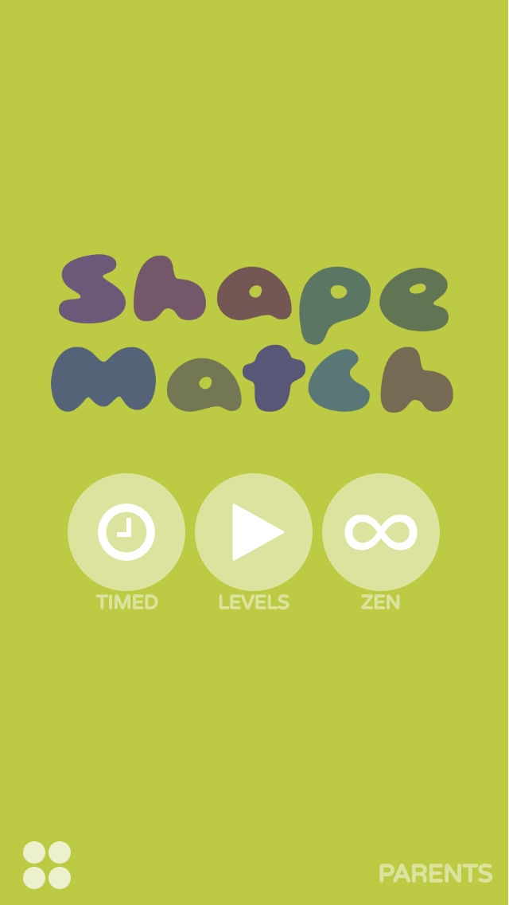
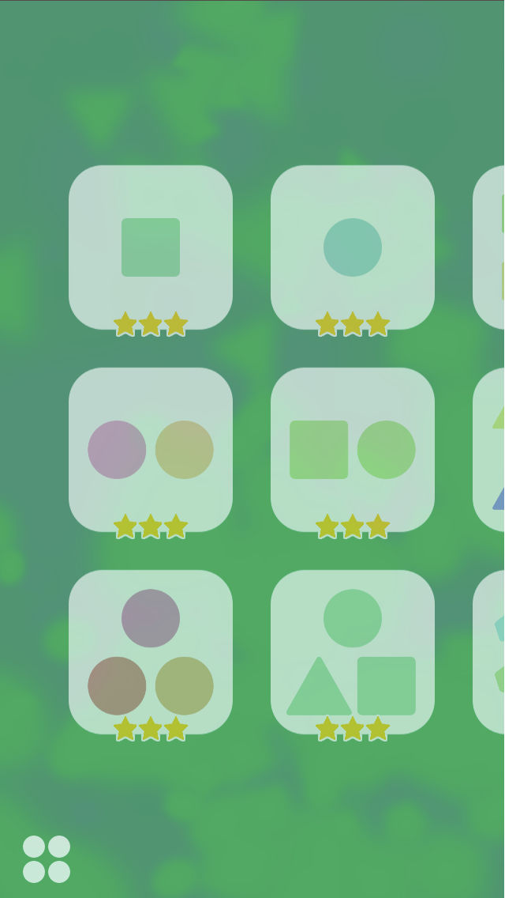
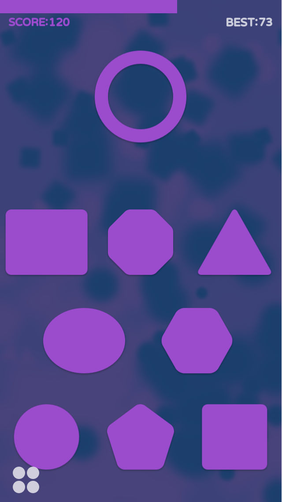
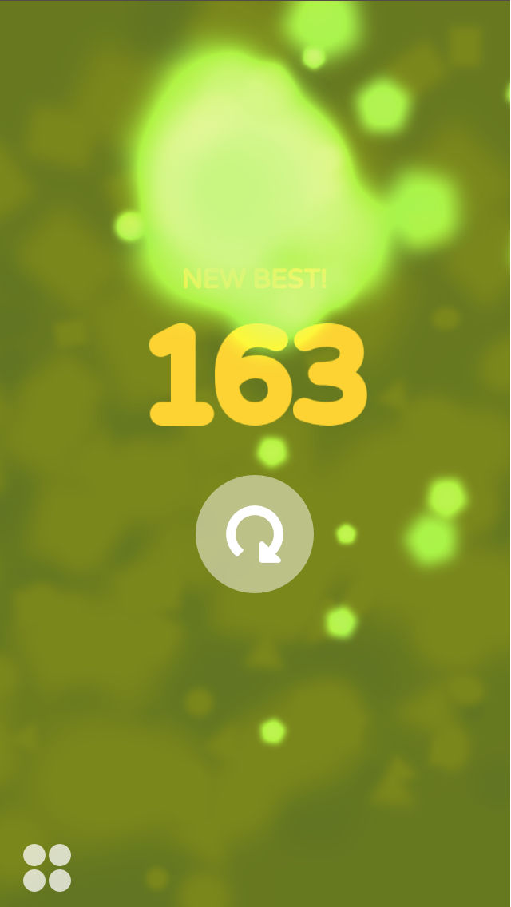

# Shape Match Kids

Educational puzzle game for toddlers released in 2015 for iOS devices. Based on visual perception and discrimination skills development concepts. Now released as open source under MIT license.

All music and sound effect assets with proprietary licenses were removed. Refer to the `filenames.txt` files for proper naming of your replacements.

Created using an older version of [Corona SDK](https://coronalabs.com/) (latest at that time).

[Here's a short trailer](https://youtu.be/ZuEp_URFLlU) of the game.

[Here's a quick video](https://www.instagram.com/p/4fuF2gLwLu/) of the game in action by [@makelearngo](https://www.instagram.com/makelearngo/).

## Screenshots

    

## App Store Description

Give your child the edge! Enhance their cognitive skills!

“*It has quickly become a favorite app of Tommy’s, and would be a great addition to the app collection of any toddler or preschooler!*”
― [MakeLearnGo.com](https://makelearngo.com/2015/05/19/favorite-mostly-free-art-shapes-colors-apps-ipad-iphone-ipod-touch-for-1-2-year-olds/)

Shape Match Kids is a fun and colorful shape matching game that will help enhance your preschooler's visual perception and discrimination skills.

Let your little one immerse in a world of colors, sounds and shapes. Play through 18 levels that start off easy and become more and more challenging as your child progresses.

Unlock two bonus game modes after completing all levels. Relax in Zen mode or compete in an exciting round of Timed mode that will put your kid's newly mastered skills to good use.

Dynamically generated backgrounds and delightful sound and visual effects ensure the game stays fun and fresh. No ads or in-app purchases to distract your child from enjoying this unique learning experience.

**Features**

* 18 levels of shape matching fun!
* Zen mode for endless, relaxed play.
* Timed mode for competing with other kids, or even with the parents!
* Beautiful dynamically generated backgrounds, visual effects and colors.
* Parental Gate restricts access to external links.
* Zero ads or in-app purchases.
